<h2>TensorflowSharpUNet-Image-Segmentation-Augmented-GastrointestinalPolyp (2024/03/24)</h2>

This is the fifth experimental Image Segmentation project for GastrointestinalPolyp  based on
the <a href="https://github.com/sarah-antillia/Tensorflow-Image-Segmentation-API">Tensorflow-Image-Segmentation-API</a>, and
<a href="https://drive.google.com/file/d/1f9Bwjt2rKstDRgv5zztfrBl-DLZNo--c/view?usp=sharing">
GastrointestinalPolyp-ImageMask-Dataset.zip</a> 
 
 
Segmentation samples by TensorflowSharpUNet Model. 
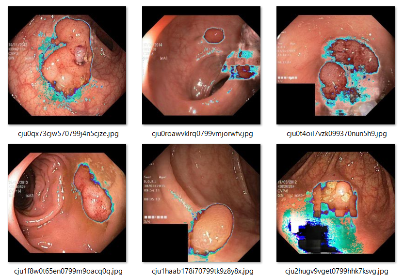
 
 

We will use an online dataset augmentation strategy based on Python script <a href="./src/ImageMaskAugmentor.py">
ImageMaskAugmentor.py</a> to train GastrointestinalPolyp Segmentation Model.  

Please see our experiments.  
<li>
<a href="https://github.com/atlan-antillia/Image-Segmentation-Gastrointestinal-Polyp">
Image-Segmentation-Gastrointestinal-Polyp</a>
</li>

<li>
<a href="https://github.com/sarah-antillia/TensorflowMultiResUNet-Segmentation-Gastrointestinal-Polyp">
TensorflowMultiResUNet-Segmentation-Gastrointestinal-Polyp 
</a>
</li>
<li>
<a href="https://github.com/sarah-antillia/TensorflowSwinUNet-Image-Segmentation-Augmented-GastrointestinalPolyp">
TensorflowSwinUNet-Image-Segmentation-Augmented-GastrointestinalPolyp 
</a>
</li>
<li>
<a href="https://github.com/sarah-antillia/TensorflowEfficientUNet-Image-Segmentation-Augmented-GastrointestinalPolyp">
TensorflowEfficientUNet-Image-Segmentation-Augmented-GastrointestinalPolyp 
</a>
</li>
 
We use TensorflowSharpUNet Model
<a href="./src/TensorflowSharpUNet.py">TensorflowSharpUNet.py</a> for this GastrointestinalPolyp Segmentation. 

Our TensorflowSharpUNet class is based on the following implementation. 
<a href="https://github.com/hasibzunair/sharp-unets/blob/master/demo.ipynb">
Hasibzunair: sharp-unets</a> 
 
 
<h3>1. Dataset Citation</h3>

The image dataset used here has been taken from the following kaggle web site. 
<a href="https://www.kaggle.com/datasets/debeshjha1/kvasirseg">Kvasir-SEG Data (Polyp segmentation & detection)</a>
  
<b>About Dataset</b>
<pre>
Kvasir-SEG information:
The Kvasir-SEG dataset (size 46.2 MB) contains 1000 polyp images and their corresponding ground truth 
from the Kvasir Dataset v2. The images' resolution in Kvasir-SEG varies from 332x487 to 1920x1072 pixels. 
The images and its corresponding masks are stored in two separate folders with the same filename. 
The image files are encoded using JPEG compression, facilitating online browsing. 
The open-access dataset can be easily downloaded for research and educational purposes.
</pre>

<b>Applications of the Dataset</b> 
<pre>
The Kvasir-SEG dataset is intended to be used for researching and developing new and improved methods 
for segmentation, detection, localization, and classification of polyps. 
Multiple datasets are prerequisites for comparing computer vision-based algorithms, and this dataset 
is useful both as a training dataset or as a validation dataset. These datasets can assist the 
development of state-of-the-art solutions for images captured by colonoscopes from different manufacturers. 
Further research in this field has the potential to help reduce the polyp miss rate and thus improve 
examination quality. The Kvasir-SEG dataset is also suitable for general segmentation and bounding box 
detection research. In this context, the datasets can accompany several other datasets from a wide 
range of fields, both medical and otherwise.
</pre>
<!--
<b>Ground Truth Extraction</b> 
<pre>
We uploaded the entire Kvasir polyp class to Labelbox and created all the segmentations using this application. 
The Labelbox is a tool used for labeling the region of interest (ROI) in image frames, i.e., the polyp regions 
for our case. We manually annotated and labeled all of the 1000 images with the help of medical experts. 
After annotation, we exported the files to generate masks for each annotation. 
The exported JSON file contained all the information about the image and the coordinate points for generating 
the mask. To create a mask, we used ROI coordinates to draw contours on an empty black image and fill the 
contours with white color. The generated masks are a 1-bit color depth images. The pixels depicting polyp tissue, 
the region of interest, are represented by the foreground (white mask), while the background (in black) does not 
contain positive pixels. Some of the original images contain the image of the endoscope position marking probe, 
ScopeGuide TM, Olympus Tokyo Japan, located in one of the bottom corners, seen as a small green box. 
As this information is superfluous for the segmentation task, we have replaced these with black boxes in the 
Kvasir-SEG dataset.
</pre>
-->
See also:
<pre>
Kvasir-SEG
https://paperswithcode.com/dataset/kvasir-seg
</pre>

<h3>
<a id="2">
2 GastrointestinalPolyp-ImageMask Dataset
</a>
</h3>
 If you would like to train this GastrointestinalPolyp Segmentation model by yourself,
please download the dataset from the google drive 
<a href="https://drive.google.com/file/d/1f9Bwjt2rKstDRgv5zztfrBl-DLZNo--c/view?usp=sharing">
GastrointestinalPolyp-ImageMask-Dataset.zip</a>.
 

Please see also the <a href="https://github.com/sarah-antillia/ImageMask-Dataset-GastrointestinalPolyp">ImageMask-Dataset-GastrointestinalPolyp</a>. 
Please expand the downloaded ImageMaskDataset and place them under <b>./dataset</b> folder to be

<pre>
./dataset
└─GastrointestinalPolyp
    ├─test
    │  ├─images
    │  └─masks
    ├─train
    │  ├─images
    │  └─masks
    └─valid
        ├─images
        └─masks
</pre>
 
 
<b>GastrointestinalPolyp Dataset Statistics</b> 
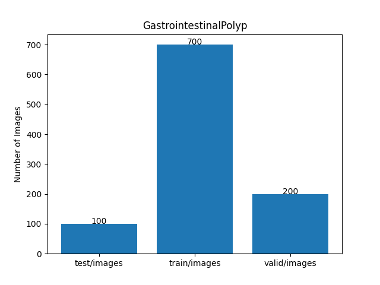 
As shown above, the number of images of train and valid dataset is not necessarily large. 
 

<h3>
<a id="3">
3 TensorflowSharpUNet
</a>
</h3>
This <a href="./src/TensorflowSharpUNet.py">TensorflowSharpUNet</a> model is slightly flexibly customizable by a configuration file. 
For example, <b>TensorflowSharpUNet/GastrointestinalPolyp</b> model can be customizable
by using <a href="./projects/TensorflowSharpUNet/GastrointestinalPolyp/train_eval_infer.config">train_eval_infer.config</a>
<pre>
; train_eval_infer.config
; 2024/03/23 (C) antillia.com

[model]
model          = "TensorflowSharpUNet"
generator      = True
image_width    = 512
image_height   = 512
image_channels = 3
num_classes    = 1
filters        = [16, 32, 64, 128, 256]
max_filter     = 512
kernel_size    = 3
base_ksize     = (3,3)
dilation       = (2,2)
activation     = "mish"
optimizer      = "Adam"
;dropout_rate   = 0.02
learning_rate  = 0.0001
clipvalue      = 0.5
loss           = "bce_dice_loss"
metrics        = ["binary_accuracy"]
show_summary   = False

[dataset]
datasetclass  = "ImageMaskDataset"
resize_interpolation = "cv2.INTER_CUBIC"

[train]
save_model_file = "best_model.h5"

dataset_splitter = True
learning_rate_reducer = True
reducer_patience      = 5
steps_per_epoch       = 200
validation_steps      = 100

epochs        = 100
batch_size    = 4
patience      = 10
metrics       = ["binary_accuracy", "val_binary_accuracy"]
model_dir     = "./models"
save_weights_only = True

eval_dir      = "./eval"
image_datapath = "../../../dataset/GastrointestinalPolyp/train/images/"
mask_datapath  = "../../../dataset/GastrointestinalPolyp/train/masks/"
create_backup  = False

[eval]
image_datapath = "../../../dataset/GastrointestinalPolyp/valid/images/"
mask_datapath  = "../../../dataset/GastrointestinalPolyp/valid/masks/"

[test]
image_datapath = "../../../dataset/GastrointestinalPolyp/test/images/"
mask_datapath  = "../../../dataset/GastrointestinalPolyp/test/masks/"

[infer] 
images_dir = "../../../dataset/GastrointestinalPolyp/test/images/"
output_dir    = "./test_output"
merged_dir    = "./test_output_merged"

[mask]
blur      = True
binarize  = True
threshold = 128

[generator]
debug        = True
augmentation = True

[augmentor]
vflip    = True
hflip    = True
rotation = True
angles   = [0, 90, 180, 270,]
shrinks  = [0.8]
shears   = [0.2]
transformer = True
alpah       = 1300
sigmoid     = 8

</pre>

As shown above in [model] section, we use the following 'filters' and 'dilation' settings to improve segmentation accuracy. 
Please see also the original sharp_unet demo implementation <a href="https://github.com/hasibzunair/sharp-unets/blob/master/demo.ipynb">
Hasib Zunair: Biomedical Image segmentation with Sharp U-Net
</a>
<pre>
[model]
filters        = [16, 32, 64, 128, 256]
dilation       = (2,2)
</pre>

Please note that the online augmentor 
<a href="./src/ImageMaskAugmentor.py">
ImageMaskAugmentor.py</a> reads the parameters in [generator] and [augmentor] sections, and yields some images and mask depending on the batch_size,
 which are used for each epoch of the training and evaluation process of this UNet Model. 
<pre>
[augmentor]
vflip    = True
hflip    = True
rotation = True
angles   = [0, 90,180, 270]
shrinks  = [0.8]
shears   = [0.2]
transformer = True
alpah       = 1300
sigmoid     = 8
</pre>
Depending on these parameters in [augmentor] section, it will generate vflipped, hflipped, rotated, shrinked,
sheared, elastic-transformed images and masks
from the original images and masks in the folders specified by image_datapath and mask_datapath in 
[train] and [eval] sections. 
<pre>
[train]
image_datapath = "../../../dataset/GastrointestinalPolyp/train/images/"
mask_datapath  = "../../../dataset/GastrointestinalPolyp/train/masks/"
[eval]
image_datapath = "../../../dataset/GastrointestinalPolyp/valid/images/"
mask_datapath  = "../../../dataset/GastrointestinalPolyp/valid/masks/"
</pre>

For more detail on ImageMaskAugmentor.py, please refer to
<a href="https://github.com/sarah-antillia/Image-Segmentation-ImageMaskDataGenerator">
Image-Segmentation-ImageMaskDataGenerator.</a>.
    
 

<h3>
3.1 Training
</h3>
Please move to the <b>./projects/TensorflowSharpUNet/GastrointestinalPolyp</b> folder, 
and run the following bat file to train TensorflowUNet model for GastrointestinalPolyp. 
<pre>
./1.train_generator.bat
</pre>
, which simply runs <a href="./src/TensorflowUNetGeneratorTrainer.py">TensorflowUNetGeneratorTrainer.py </a>
in the following way.

<pre>
python ../../../src/TensorflowUNetGeneratorTrainer.py ./train_eval_infer.config
</pre>
Train console output: 
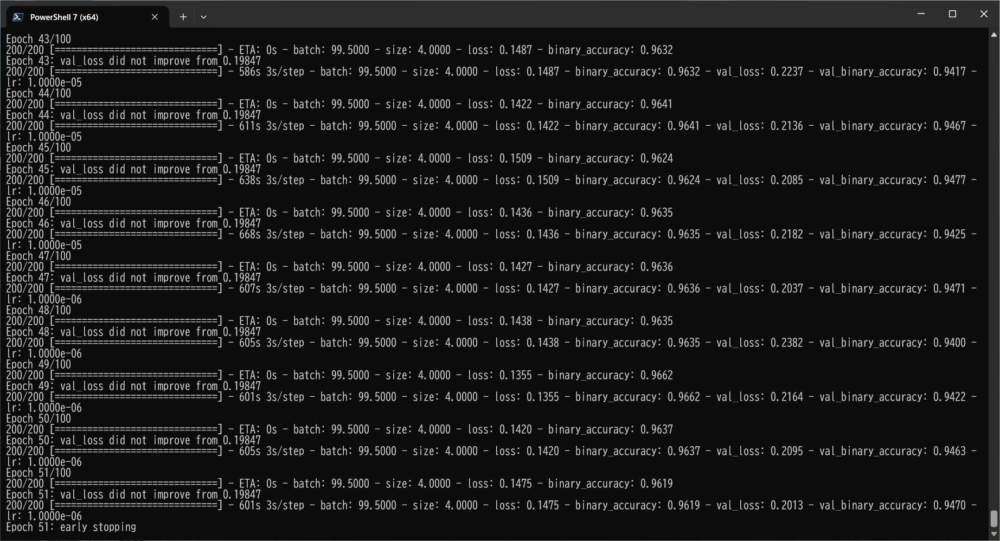 
Train metrics: 
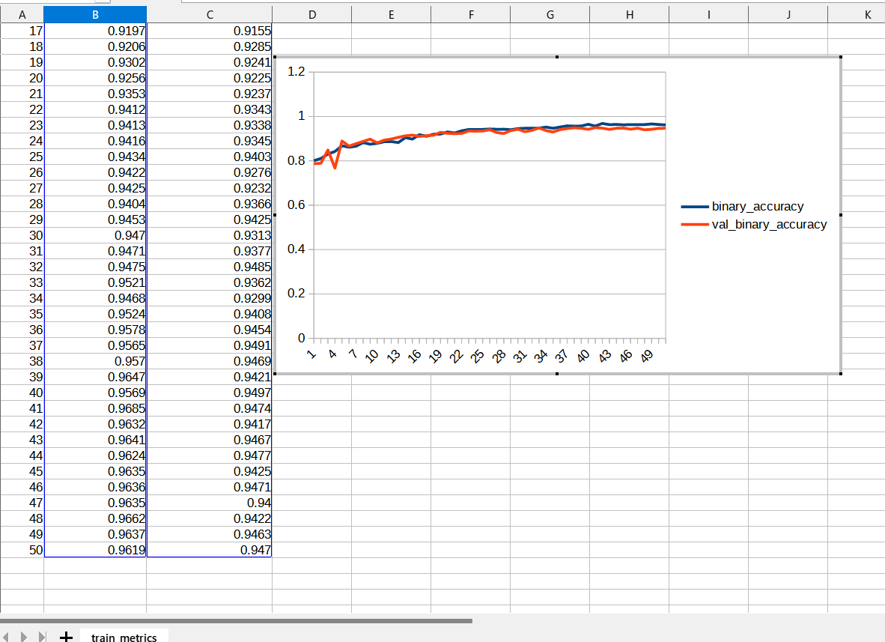 
Train losses: 
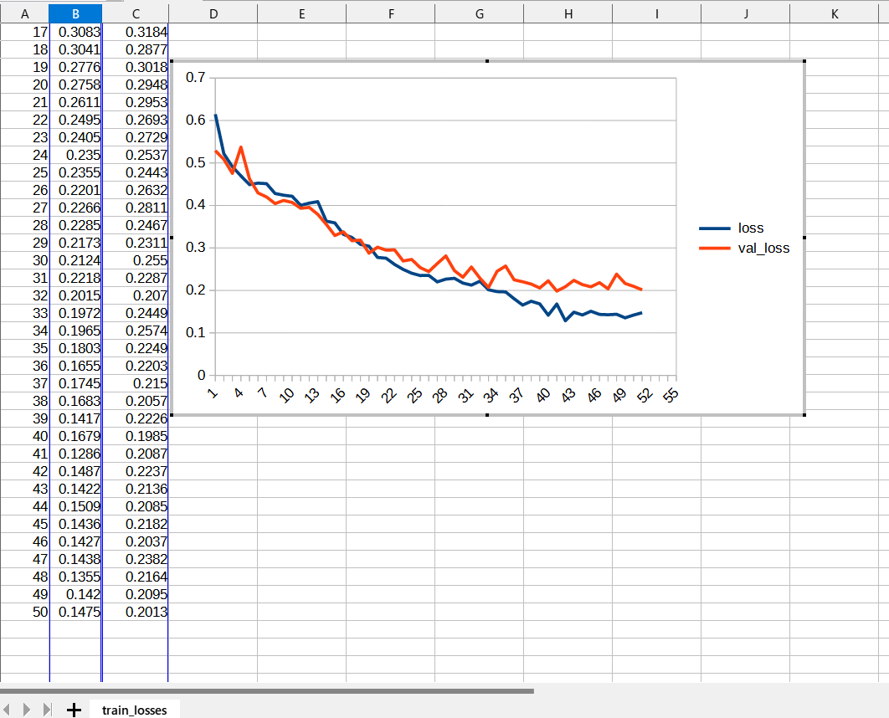 
 
The following debug setting is helpful whether your parameters in [augmentor] section are good or not good.
<pre>
[generator]
debug     = True
</pre>
You can check the yielded images and mask files used in the actual train-eval process in the following folders under
<b>./projects/TensorflowSharpUNet/GastrointestinalPolyp/</b>.  
<pre>
generated_images_dir
generated_masks_dir
</pre>

Sample images in generated_images_dir 
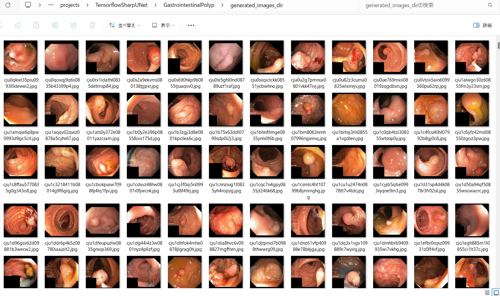 
Sample masks in generated_masks_dir 
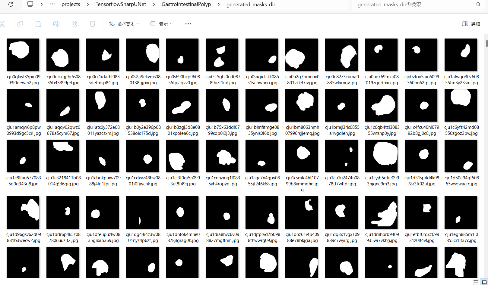 

<h3>
3.2 Evaluation
</h3>
Please move to the <b>./projects/TensorflowSharpUNet/GastrointestinalPolyp</b> folder, 
and run the following bat file to evaluate TensorflowUNet model for GastrointestinalPolyp. 
<pre>
./2.evaluate.bat
</pre>
<pre>
python ../../../src/TensorflowUNetEvaluator.py ./train_eval_infer.config
</pre>
Evaluation console output: 
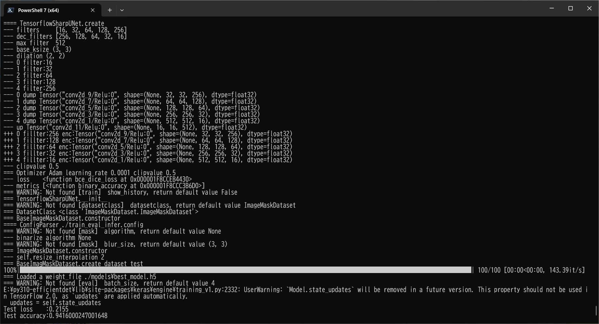
<pre>
Test loss    :0.2155
Test accuracy:0.9416000247001648
</pre>

As shown above, the loss score for the test dataset is slightly higher than that of the fourth experiment based on TensorflowEfficientUNet Model 
<a href="https://github.com/sarah-antillia/TensorflowEfficientUNet-Image-Segmentation-Augmented-GastrointestinalPolyp">TensorflowEfficientUNet-Image-Segmentation-Augmented-GastrointestinalPolyp</a>
 
 

<pre>
Test loss    :0.1439
Test accuracy:0.9678999781608582
</pre>
 
See also the first experiment based on TensorflowSlightlyFlexibleUNet Model
<a href="https://github.com/atlan-antillia/Image-Segmentation-Gastrointestinal-Polyp">Image-Segmentation-Gastrointestinal-Polyp</a>
 
  

 
<h2>
3.3 Inference
</h2>
Please move to a <b>./projects/TensorflowSharpUNet/GastrointestinalPolyp</b> folder 
,and run the following bat file to infer segmentation regions for images by the Trained-TensorflowUNet model for GastrointestinalPolyp. 
<pre>
./3.infer.bat
</pre>
<pre>
python ../../../src/TensorflowUNetInferencer.py ./train_eval_infer.config
</pre>
Sample test images 
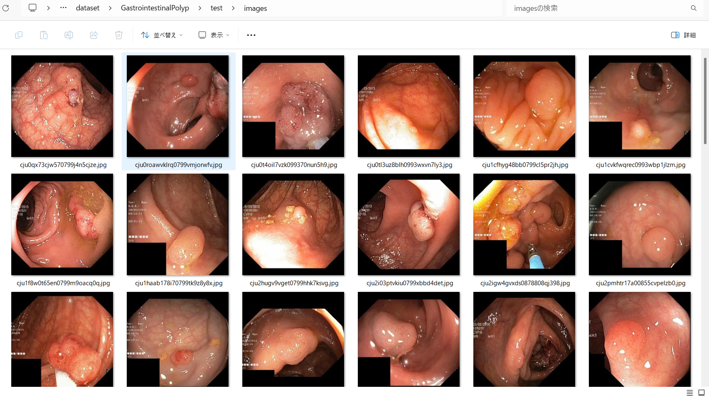 
Sample test mask (ground_truth) 
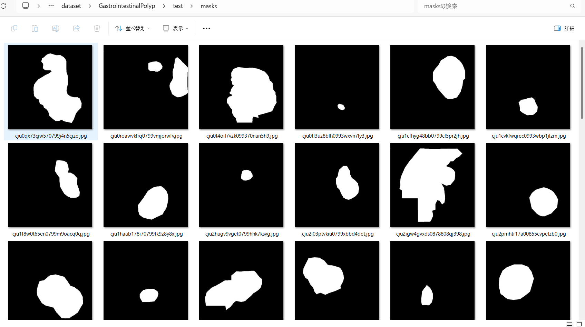 

 
Inferred test masks 
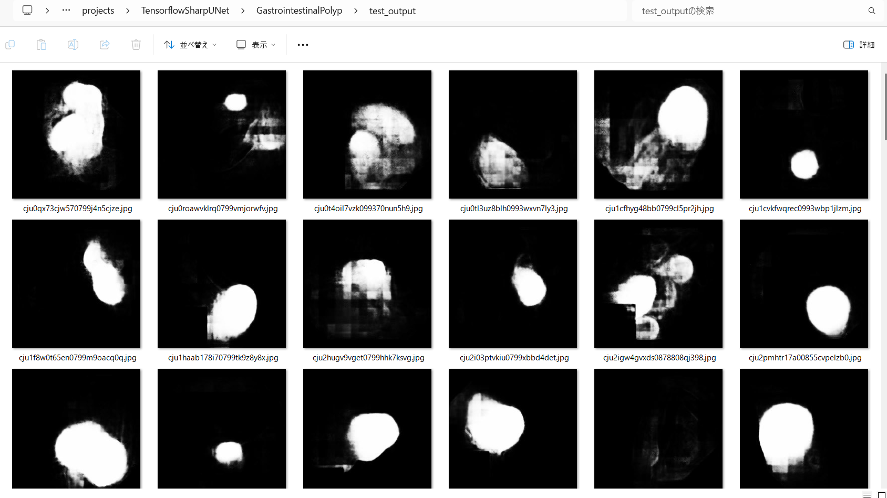 
 
Merged test images and inferred masks  
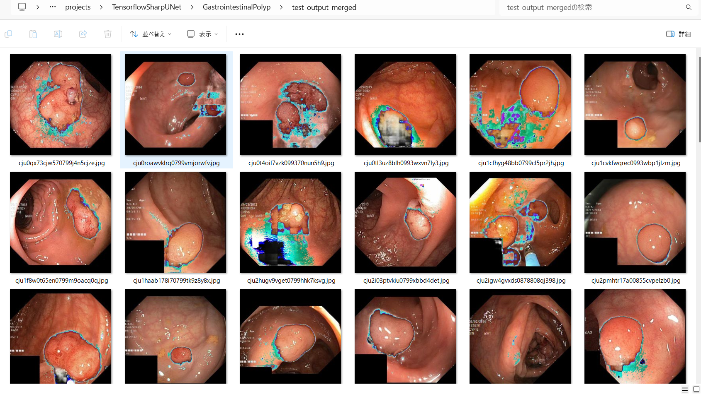  

Enlarged segementation samples 
<table>
<tr>
<td>
test/images/cju0qx73cjw570799j4n5cjze.jpg 
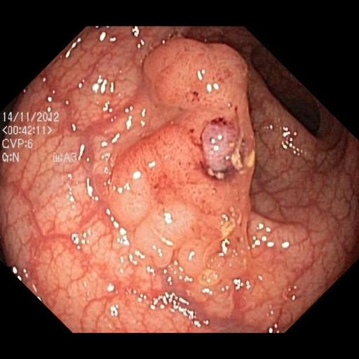

</td>
<td>
Inferred merged/cju0qx73cjw570799j4n5cjze.jpg 
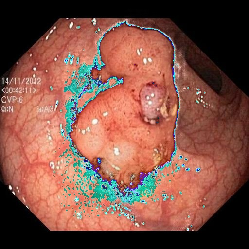
</td> 
</tr>

<tr>
<td>
test/images/cju0roawvklrq0799vmjorwfv.jpg 
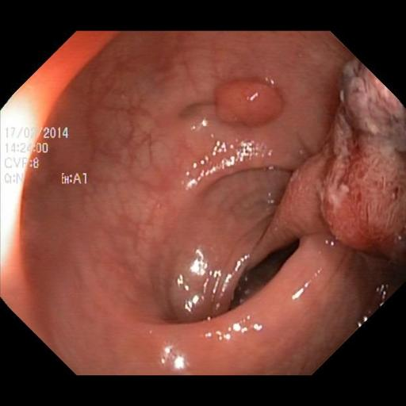

</td>
<td>
Inferred merged/cju0roawvklrq0799vmjorwfv.jpg 
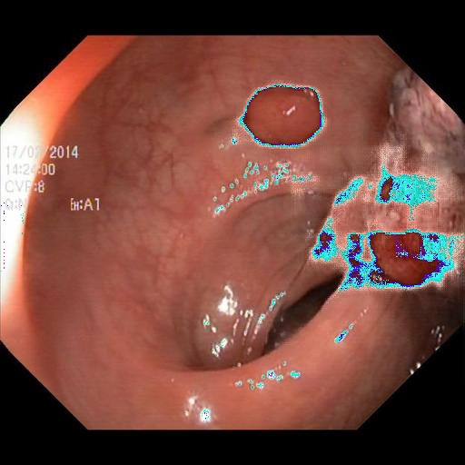
</td> 
</tr>

<tr>
<td>
test/images/cju0t4oil7vzk099370nun5h9.jpg 
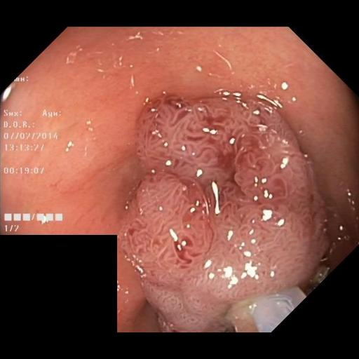

</td>
<td>
Inferred merged/cju0t4oil7vzk099370nun5h9.jpg 
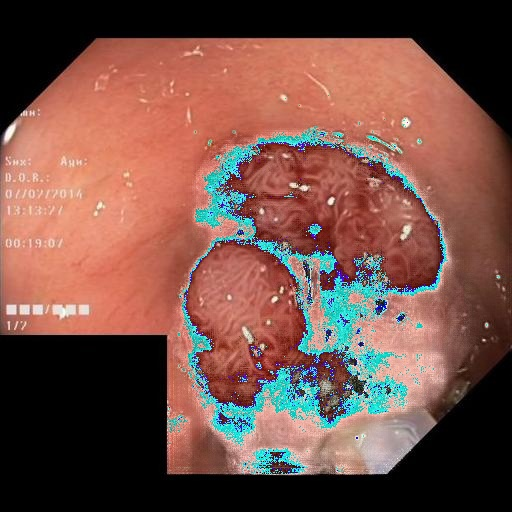
</td> 
</tr>

<tr>
<td>
test/images/cju2wtwj87kys0855kx6mddzw.jpg 
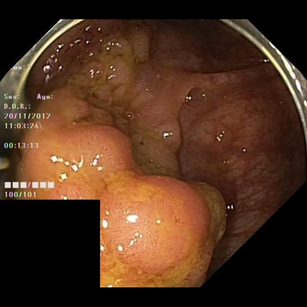

</td>
<td>
Inferred merged/cju2wtwj87kys0855kx6mddzw.jpg 
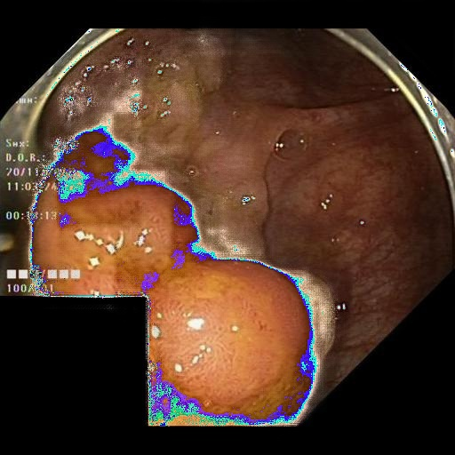
</td> 
</tr>

<tr>
<td>
test/images/cju7d9seq29zd0871nzl2uu5m.jpg 
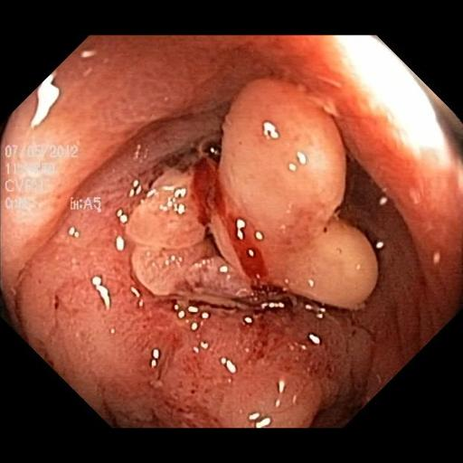

</td>
<td>
Inferred merged/cju7d9seq29zd0871nzl2uu5m.jpg 
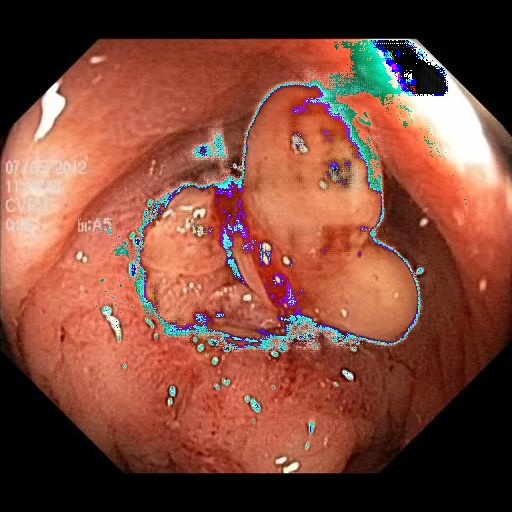
</td> 
</tr>

</table>

<h3>
References
</h3>

<b>1. Kvasir-SEG Data (Polyp segmentation & detection)</b> 
<pre>
https://www.kaggle.com/datasets/debeshjha1/kvasirseg
</pre>

<b>2. Kvasir-SEG: A Segmented Polyp Dataset</b> 
Debesh Jha, Pia H. Smedsrud, Michael A. Riegler, P˚al Halvorsen, 
Thomas de Lange, Dag Johansen, and H˚avard D. Johansen 
<pre>
https://arxiv.org/pdf/1911.07069v1.pdf
</pre>

<b>3. Semantic-Segmentation-Architecture</b> 
Nikhil Tomar  
<pre>
https://github.com/nikhilroxtomar/Semantic-Segmentation-Architecture
</pre>

<b>4. Sharp U-Net: Depthwise Convolutional Network for Biomedical Image Segmentation</b> 
<pre>
https://github.com/hasibzunair/sharp-unets/blob/master/demo.ipynb
</pre>
<pre>
@article{zunair2021sharp,
  title={Sharp U-Net: Depthwise Convolutional Network for Biomedical Image Segmentation},
  author={Zunair, Hasib and Hamza, A Ben},
  journal={Computers in Biology and Medicine},
  pages={104699},
  year={2021},
  publisher={Elsevier}
}
</pre>

<b>5. TensorflowSwinUNet-Image-Segmentation-Augmented-GastrointestinalPolyp</b> 
Toshiyuki Arai @antillia.com 
<pre>
https://github.com/sarah-antillia/TensorflowSwinUNet-Image-Segmentation-Augmented-GastrointestinalPolyp
</pre>

<b>6. TensorflowMultiResUNet-Segmentation-Gastrointestinal-Polyp</b> 
Toshiyuki Arai @antillia.com 
<pre>
https://github.com/sarah-antillia/TensorflowMultiResUNet-Segmentation-Gastrointestinal-Polyp
</pre>

<b>7. TensorflowUNet3Plus-Segmentation-Gastrointestinal-Polyp</b> 
Toshiyuki Arai @antillia.com 
<pre>
https://github.com/sarah-antillia/TensorflowUNet3Plus-Segmentation-Gastrointestinal-Polyp
</pre>

<b>8. TensorflowEfficientUNet-Segmentation-Gastrointestinal-Polyp</b> 
Toshiyuki Arai @antillia.com 
<pre>
https://github.com/sarah-antillia/TensorflowEfficientUNet-Image-Segmentation-Augmented-GastrointestinalPolyp
</pre>
